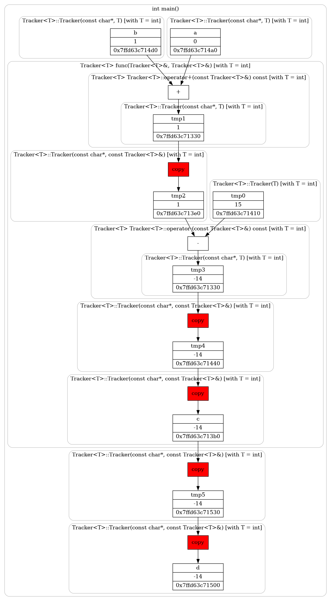
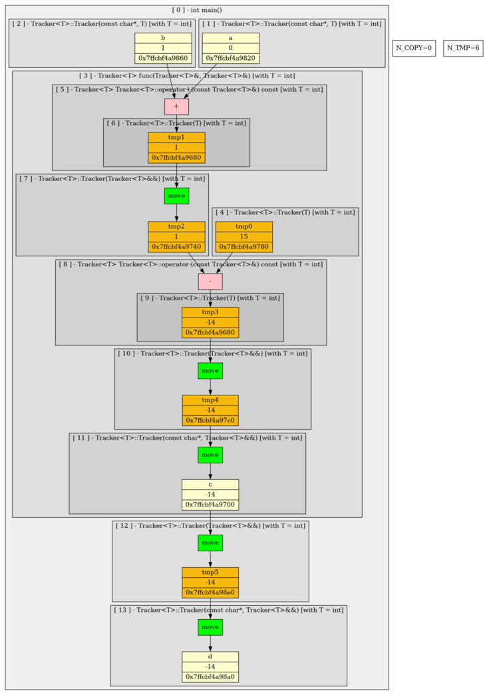
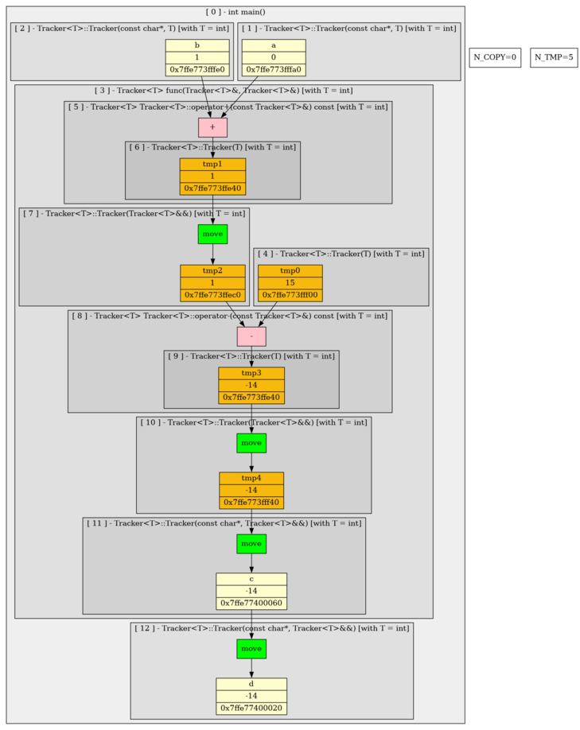
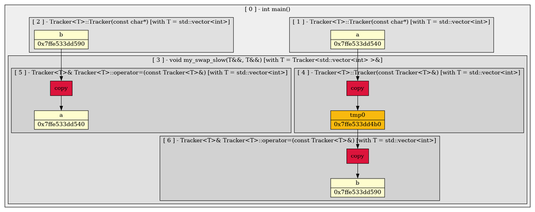
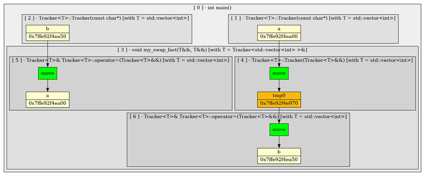

# move-copy-semantics

## Постановка проблемы
Рассмотрим следующий пример, состоящий из инициализации пары классов и вычисления по нехитрому алгоритму значения еще одного класса:

```cpp

class MyClass{
    ...
};

MyClass func(MyClass A, MyClass B)
{
    MyClass C = A + B - 15;

    return C;
}

int main()
{
    MyClass A = 0;
    MyClass B = 1;

    MyClass D = func(A, B);
    return 0;
}
```

Рассмотрим выражение, в котором происходит вычисление значение класса C. Вычисление состоит из пары шагов, которые процессором вычисляются последовательно и чтобы перейти к следующему вычислительному шагу, процессор должен сохранить куда-то значение предыдущего шага. Для этого создаются временные объекты, где сохраняется значение промежуточных шагов.

В нашем примере будут созданы 2 временных объекта - tmp0, tmp1.

```cpp
MyClass tmp0 = A + B;
MyClass tmp1 = tmp1  - 15;
MyClass C    = tmp1;
```

Следовательно во время выполнения операции происходит вызов некоторого количества конструкторов копирования для инциализации временных обьектов и сохранения промежуточных результатов. Если MyClass=int, то боятся нечего, данные копируются за O(1), но если MyClass=std::vector<int> или что еще похуже, возникнут большущие проблемы, ибо во время вычисления выражения мы будем постоянно создавать(через конструкторы копирования) и уничтожать временные векторы, что будет исключительно неприемлемо.

## Примерчик
В целях демонстрации был создан класс Tracker<T>, который позволит нам отслеживать и дампить создание временных обьектов и вызовы конструкторов копирования. Семантика алгоритма совпадаeт с тем, что был приведен выше, вместо класса MyClass был подставлен Tracker<int>. Если есть желание посмотреть, советую обратить внимание на файлик [link text](src/simple_test.cpp). Заметим только, что для начала мы выключим оптимизацию, которая позволяет не создавать временный объект для инициализации объекта того же типа, дозволив вызывать copy-конструкторы там где только можно. Для этого пропишем флаг -fno-elide-constructors.

Посмотрим на дамп и оценим количество конструкторов копирования и временных объектов.



Многовато!

## rvalue, lvalue
Дяденьки-разработчики стандарта С++ в 2011 году смогли придумать решение этой проблемы, введя rvalue, lvalue. Коротко говоря, разработчики решили разделить выражения, которые могут иметь некоторые значения(типа переменных, классов, констант) на 2 типа: (1) lvalue - это именованые переменные или аргументы, (2) rvalue - это неименнованные объекты, константы, которые очень часто представляют из себя некие временные объекты. Долго говорить о них я не берусь, советую лучше прочитать следующую статью(которая не ограничивается lvalue, rvalue) https://habr.com/ru/post/322132/. То что нам важно, так это то, что разработчки также ввели специальный тип ссылок, указывающий на то, что объект является временным, rvalue. 

## Перемещающий конструктор
Теперь мы можем создавать конструктор, допускающий rvalue ссылку на временный объект в качестве аргумента. Благодаря этому теперь мы не обязаны проводить глубокое копирование аргумента, а можем ограничиться лишь поверхностным копированием(например в случае с вектором, теперь у нас есть возможно просто свапать указатели на выделенную память, вместо того, чтобы выделять для нашего объекта свой участок и копировать каждый элемент аргумента). Теперь мы можем не тратить ресурсы машины на копирование данных умирающего обьекта(например tmp1 из примера выше), а просто отдать эти ресурсы новому обьекту, который будет жить дальше. 

Разрешим перемещающие конструкторы в нашем классе Tracker<T> и посмотрим на изменения дампа.


О чудо, красное стало зеленым, а конструкторы копирования стали перемещающими конструкторами!

Теперь уберем -fno-elide-constructors и посмотрим что изменится.



Как и ожидалось, одна временная переменная ушла.

## lvalue nonconst и rvalue const
Стандарт также позволяет реализовывать конструктор копирования через nonconst lvalue ссылки, что является довольно небезопасным способом для большинства случаев(очевидно почему). Адекватные примеры мне неизвестны, буду рад, если кто-то поделится.

Что будет если мы реализуем конструктор перемещения через const rvalue ссылки? Обьект будет позиционировать себя как временный, но конструктор к несчастью(или к радости?) данные "украсть" не сможет.

## std::move

Как только rvalue ссылка, являясь аргументом какого-то метода или функции, попадает в скоп оных, она будет уже именнованной переменной, а следовательно lvalue ссылкой. Теперь мы не сможем передать аргумент другой функции, которая принимает rvalue ссылку, что очень сильно ограничивает возможности программиста. Для обхода подобных случаев была придумана идеома, позволяющая приводить lvalue, rvalue ссылки к rvalue ссылкам.

## более наглядный пример

Посмотрим количественно, как использование перемещающих конструкторов может способоствовать увеличению произодительности программы. Для этого посмотрим насколько функция swap, определенная с помощью перемещающих конструкторов будет быстрее swap'a на копирующих конструкторов. Для этих целей был написан файлик [link text](src/swap_test.cpp).

По итогу, замерив реальное время исполнения программы, используя комманду time в системе linux, были вычислены следующие результаты:

| тип функции  | execution real-time |
| ------------- | ------------- |
| is_optimized = false  | 4,625s  |
| is_optimized = true  | 1,668s  |

Видим, что даже в таком простом примере, swap на копирующих конструкторах оказался более чем в 2 раза медленнее оптимизированного варианта

## std::forward

// TODO: написать чето про форвард

Приведём примеры, которые показывают, что std::move, std::forward семантически абсолютно не одинаковы


### move_only

```cpp
#include <iostream>
#include <vector>
#include "nstd.h"
#include <utility>

std::vector<std::vector<int>> secret_storage = {
    {0, 0, 0, 0},
    {1, 2, 3, 4}
};

template<class Container, typename T>
void insert_key_wrong(Container& container, T&& value) {
    container.push_back(nstd::move<T>(value));
}

template<class Container, typename T>
void insert_key_correct(Container& container, T&& value) {
    container.push_back(nstd::forward<T>(value));
}

void print_key(const std::vector<int>& key) {
    for(auto i : key)
        std::cout << i << " ";
    std::cout << "\n";
}

int main() { 

    std::vector<int> secret_key1 = {884422, 0, 0, 0};
    print_key(secret_key1);

    insert_key_wrong(secret_storage, secret_key1);
    print_key(secret_key1);

    //--------------------------------------------------------

    std::vector<int> secret_key2 = {0, 0, 0, 5432};
    print_key(secret_key2);

    insert_key_correct(secret_storage, secret_key2);
    print_key(secret_key2);

    return 0;
}
```

Данный пример является демонстрацией, что nstd::move может портить данные lvalue ссылки, чего разработчик может не предпологать. Пользователь хранит ключ для какого-то хранилища в классе std::vector<int>. Функция insert_key_* должна добавлять новый ключ в хранилище. Функция insert_key_wrong работает некорректно, т.к. конвертирует lvalue ссылку на ключ пользователя в rvalue ссылку и передаёт объект в конструктор перемещения, который вызывается в методе push_back у хранилища. Конструктор просто "украдёт" данные у ключа у пользователя, что будет некорректным с точки зрения семантики, т.к. пользователь может иметь желание хранить ключ у себя дальше. Поэтому корректным способом будет реализация с помощью std::forward, которая передаст lvalue ссылку на ключ в конструктор копирования, который ничего не украдёт у пользователя.

### forward_only

Данный пример показывает, что реализация swap через std::forward( см. [link text](src/forward_only.cpp)) будет приводить к вызовам конструкторов копирования вместо более приоритетных конструкторов перемещения. Посмотрим на дампы программ и поймём, что это в самом деле так:




